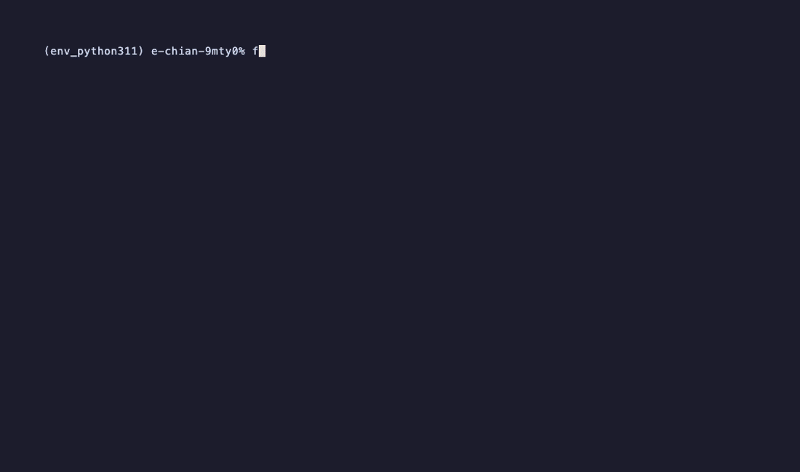

# fr-fzf

Find code, copy code, paste into Claude — without leaving your terminal.

<!-- TODO: record demo with asciinema or kap, save to docs/demo.gif, then uncomment -->
<!--  -->

- `fr` — browse files/directories with live preview, hop between dirs, edit a file, copy a path.
- `findtext` — recursive grep with live preview of the matched line in context.
- `fr` can pivot into `findtext` (ctrl-f) without leaving the loop.

## Why?

You opened a terminal for Claude Code. Then you alt-tabbed to an IDE to find a file. Then you alt-tabbed back to paste it. `fr-fzf` removes the round trip.

- **Made for Claude Code workflows.** `findtext`'s ctrl-g copies `<absolute_path>` + ±10 lines around the match to your clipboard — exactly the shape you paste into a Claude prompt. One keystroke, no manual copy.
- **Discard the IDE.** If your editor already lives in the terminal (micro, vim, helix, nvim), you don't need an Electron file browser too. `fr` is fzf-fast with live previews; `findtext` is instant grep with context. One buffer, full keyboard.
- **Two keystrokes from anywhere on disk to your clipboard.** `fr` → ctrl-f → type pattern → ctrl-g. Done.

## Dependencies

Required:

- [`fzf`](https://github.com/junegunn/fzf)
- [`bat`](https://github.com/sharkdp/bat) — syntax-highlighted previews
- `grep` — POSIX, present everywhere
- `zsh` — both `fr` and `findtext` use zsh

Optional (graceful degradation):

- [`fd`](https://github.com/sharkdp/fd) — faster than `find`; fr falls back to `find` if missing
- [`tree`](https://formulae.brew.sh/formula/tree) — directory previews in fr
- [`micro`](https://github.com/zyedidia/micro) — used by ctrl-e in `findtext`

Clipboard: `pbcopy` (macOS). On Linux replace with `xclip -selection clipboard` or `wl-copy` — see [Portability](#portability).

## Install

### oh-my-zsh

```sh
git clone https://github.com/eugene/fr-fzf ~/.oh-my-zsh/custom/plugins/fr-fzf
```

Then add `fr-fzf` to the `plugins=(...)` line in `~/.zshrc`.

### zinit

```sh
zinit load eugene/fr-fzf
```

### antigen

```sh
antigen bundle eugene/fr-fzf
```

### Manual

```sh
git clone https://github.com/eugene/fr-fzf ~/.fr-fzf
echo 'source ~/.fr-fzf/fr.plugin.zsh' >> ~/.zshrc
```

Reload your shell (`exec zsh`) after install.

## Usage

### `fr`

Run `fr` in any directory.

| Key | Action |
| --- | --- |
| `Enter` | Enter directory / open file in `micro` |
| `Ctrl-E` | `cd` into the highlighted directory and exit fzf |
| `Ctrl-F` | Prompt for a grep pattern and launch `findtext` here |
| `Ctrl-G` | Copy absolute path to clipboard |
| `Ctrl-\` | Cycle preview window: 99% width / hidden / default |
| `Esc` | Quit |

The first entry is always `..` so you can navigate up.

### `findtext`

```sh
findtext <pattern> [path]
```

Path defaults to `.`.

| Key | Action |
| --- | --- |
| `Enter` | Default fzf select |
| `Ctrl-E` | Open match in `micro` at the matched line |
| `Ctrl-G` | Copy absolute path + ±10 lines around the match to clipboard |
| `Ctrl-\` | Cycle preview window |
| `Esc` | Quit |

## Portability

The bundled binds use `pbcopy` (macOS-only). To run on Linux, edit `fr.plugin.zsh` and `bin/findtext` and replace `pbcopy` with one of:

- `xclip -selection clipboard` (X11)
- `wl-copy` (Wayland)

A future version may auto-detect.

## License

MIT — see [LICENSE](LICENSE).
